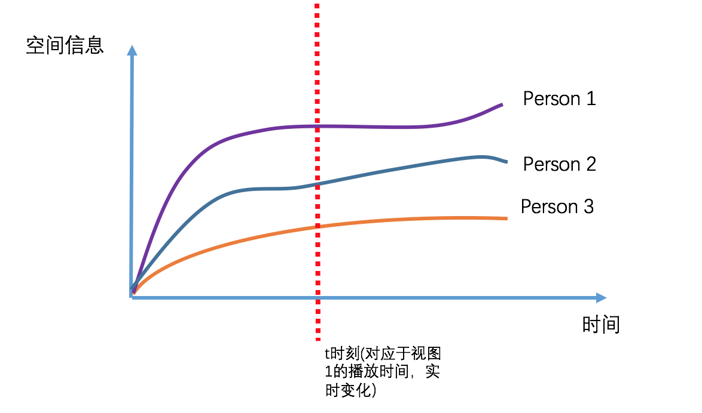

### Surveillance video track

To show person's track under a surveillance video

#### Download
1. First clone/download the whole project into your computer.
2. Download [Data](https://pan.baidu.com/s/1o8dhZ2y)(Complete version).
3. Cover these directories: ./website/person, ./website/time, ./website/mapping

#### Usage
1. first open the terminal, open a local server
```
$ cd track
$ anywhere
```
2. open the track.html
3. Follow the instructions of this video

#### Functions
1. 视图1: 轨迹播放视图
  * 将现有的按键变化做成视频播放形式
  * 快进快退
  * 定位时间点
2. 视图2: 时空视图
<p></p>

  * 使用全局的t，随着视频的播放而变化。
  * 动态显示当前时间所有的person的空间信息（曲线动态增删）
  * 定位竖线，使视图1、3也同时发生改变
3. 视图3: 监控视频视图（待定）
